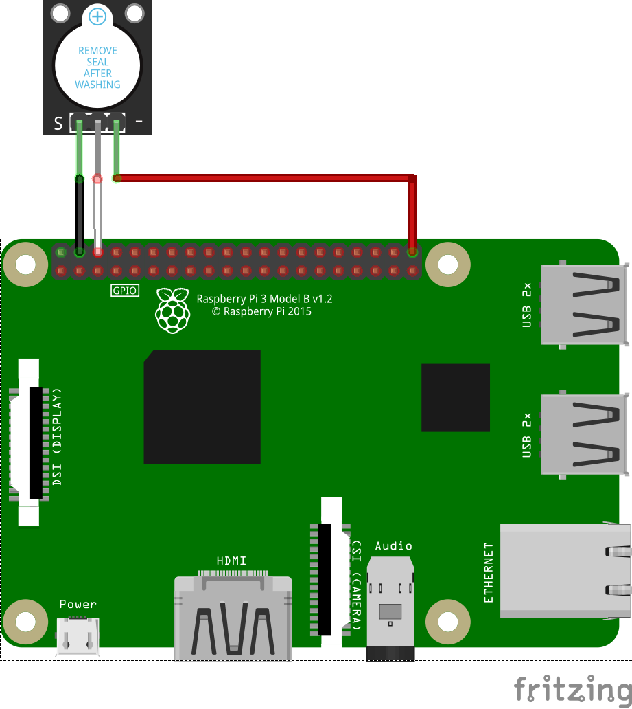

## Parts

- Raspberry pi 3 Model B V1.2
- 5V Active Alarm Buzzer Module

## Circuit

| buzzer   | +            | -          | out        |
|:---------|:-------------|:-----------|:-----------|
| **RPi3** | **5v Power** | **Ground** | **pin 40** |

