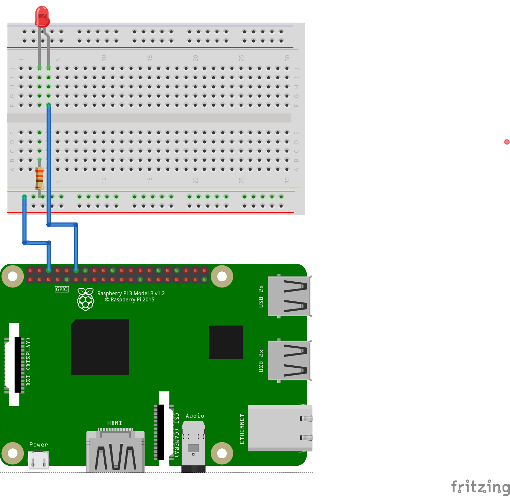

## Parts
- Led
- resistor 330 ohm
## Circuit

| Led           | Anode (longer) | Cathode (shorter) |
|:--------------|:---------------|:------------------|
| **Resistor**  | **No**             | **Yes**               |
| **Raspberry** | **GPIO18**         | **Ground**            |

